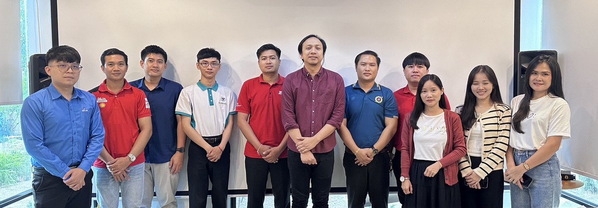
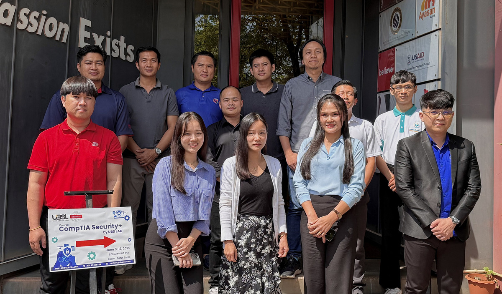

# Security Essentials
## (based on CompTIA Security+ Exam Objectives)

### Date : June 9-13, 2025

### Audiences
+ Ms. **Phonesavanh Nammakone**, ***Verisette Lao (APNIC Foundation)***
+ Ms. **Daonapha DUANGNGERN**, ***ETL Company Limited (APNIC Foundation)***
+ Ms. **Padaphone Sayakhot**, ***ETL Company Limited (APNIC Foundation)***
+ Mr. **Phansalath YILATHCHAY**, ***Seven Digital***
+ Mr. **Chanthaphone PHANTHAVONG**, ***Seven Digital***
+ Mr. **Somsavanh PHOMMANIN**, ***Electricite du Laos (EDL)***
+ Mr. **Xayyadeth CHANSAVANG**, ***Electricite du Laos (EDL)***
+ Mr. **Phouttha Singluexay**, ***KP LAO Company***
+ Mr. **Baleezup THIPHAKORN**, ***EDL-Generation Public Company***
+ Mr. **Souksakone BUALAPHAN**, ***Agricultural Promotion Bank (APB)***

### Instructor
+ **Maykin Warasart, Ph.D.**
	+ CompTIA Certified Trainer (CTT+) - Classroom Trainer

